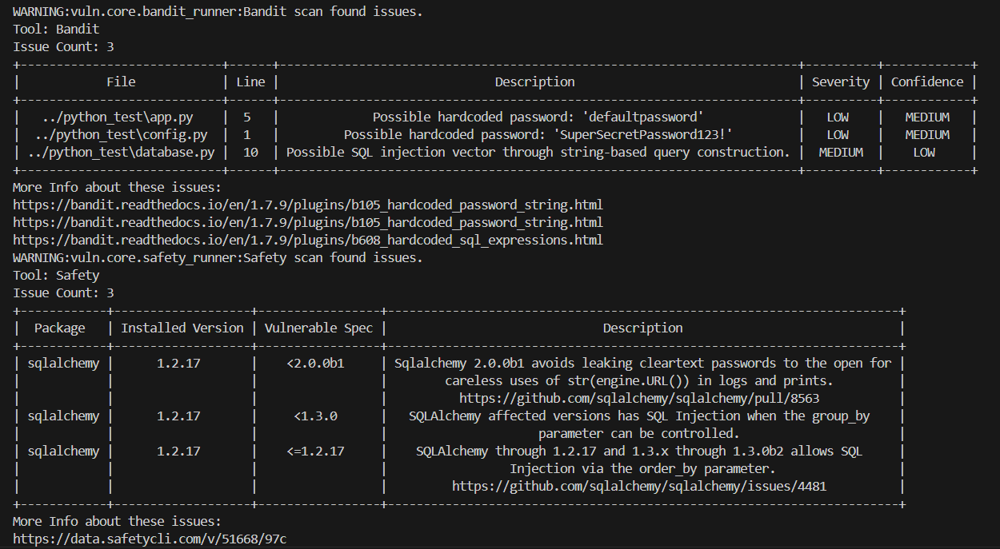

# Vuln: Python Security Scanner Tool

## Table of Contents
1. [Overview](#overview)
2. [Features](#features)
3. [Installation](#installation)
4. [Usage](#usage)
   1. [Sample Output](#sample-output)
5. [Running Tests](#running-tests)
6. [Branching Strategy](#branching-strategy)
7. [Contributing](#contributing)
8. [License](#license)

### Overview
**Vuln** is a Python-based security tool designed to scan Python codebases for common security vulnerabilities and coding practices. It integrates with popular security scanning tools such as Bandit and Safety, providing a modular and extendable framework to help developers maintain secure code.

Bandit identifies common security issues like hardcoded secrets, unsafe use of functions, and potential injection vulnerabilities in Python code.
Safety checks project dependencies for known vulnerabilities in third-party libraries, ensuring that your project does not rely on insecure packages.
With its modular design, Vuln is extendable and adaptable, making it easy to integrate additional security tools and enforce secure coding conventions across projects.

## Features
- **Bandit Module**: Scans Python code for security issues like hardcoded secrets, SQL injection, and more.
- **Safety Module**: Checks project dependencies for known vulnerabilities in third-party libraries, ensuring safe usage of external packages.
- **Error Handling**: Ensures graceful failure with informative error messages.
- **Modular Design**: Easily extend the tool with additional security scanners.

## Installation

1. Clone the repository:
    ```bash
    git clone https://github.com/yourusername/vuln.git
    cd vuln
2. Create and activate a virtual environment:
    ```bash
    python -m venv venv
    source venv/bin/activate  # On macOS/Linux
    venv\Scripts\activate     # On Windows
3. Install the required dependencies:
    ```bash
    pip install -r requirements.txt
4. Install Snyk using npm (Node.js must be installed):
    ```bash
    npm install -g snyk

## Usage
To scan a Python project for security issues using all tools, run:
```bash
python -m main --scan-path ../path/to/your/file
```

To scan a Python project for security issues using specific tools like Bandit, run:
```bash
python -m main --scan-path ../path/to/your/file --tools bandit
```
If you want to scan a specific requirements.txt file that is not in the root of your project or has a different name, you should pass the path to that file explicitly using the --requirements-file argument for the Safety tool.

Here’s how you can run the scan with the custom requirements.txt file:
```bash
python -m main --scan-path ../path/to/your/project --tools safety --requirements-file custom_requirements.txt
```

#### Explanation of Arguments:
`--scan-path`: The directory path to scan for security issues.

`--tools`: Allows you to choose which tool(s) to use for the scan (e.g., bandit, safety). If not specified, all tools will run by default.

`--requirements-file`: The default file for Safety scans is **requirements.txt** located in the root directory, following Python's standard project structure. If your project uses a different file name or places it elsewhere, you can specify the exact file path using this argument.

This setup allows you to run versatile scans tailored to your specific needs while maintaining flexibility for different project structures.

### Sample Output
   

The results are JSON-parsed, making it easy to further process or integrate into other tools if necessary.

## Running Tests
Unit tests are provided to verify the functionality of the Bandit module. You can run the tests using:

```bash
python -m unittest tests.test_bandit_runner
```

Otherwise you can run this command:

```bash
python -m unittest discover -s tests
```

This command will run all unit tests and ensure that the module works as expected.

## Branching Strategy
To maintain a clean and organized codebase, we use the following Git branching strategy:

- main: Contains production-ready code.
- develop: Integration branch for development features.
- feature/bandit-module: Dedicated branch for the Bandit security scanner module.

All new features should be developed in their own feature branches and merged into `develop` after review and testing.

## Contributing
Contributions are welcome! Please follow these steps:

1. Fork the repository.
2. Create a feature branch:
    ```bash
    Copy code
    git checkout -b feature/your-feature
3. Commit your changes:
    ```bash
    Copy code
    git commit -m 'Add your feature'
4. Push the branch:
    ```bash
    Copy code
    git push origin feature/your-feature
5. Open a pull request to the `develop` branch.

## License
This project is licensed under the MIT License. See the [LICENSE](LICENSE) file for more information.

